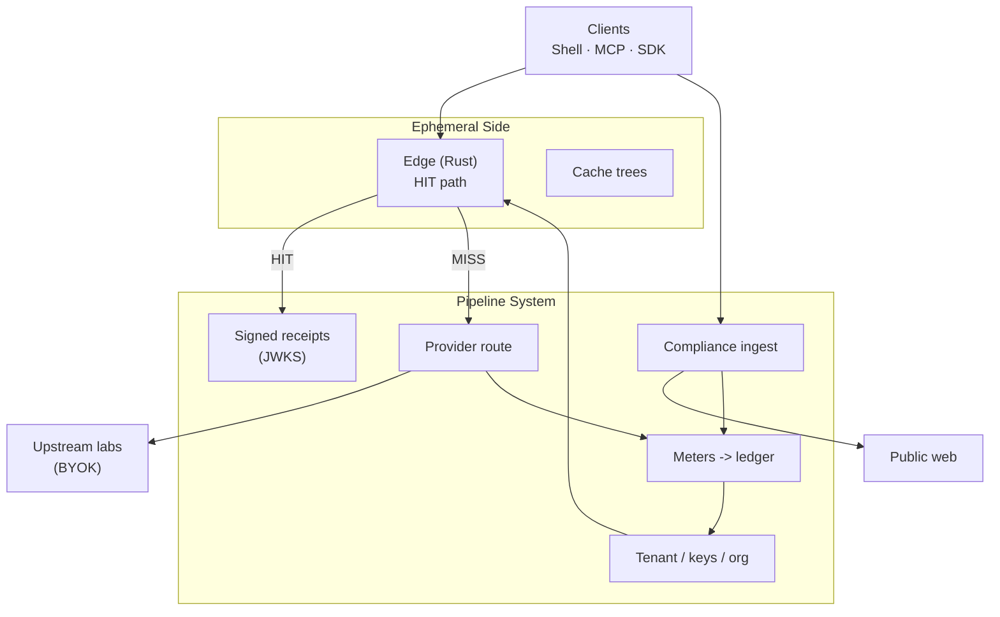

# withOhm — open client tools + architecture exhibition

**withOhm is a metered pipe between your app (or Cursor) and OpenAI/Anthropic/etc.** It replays byte-identical requests for free instead of re-paying the model, fetches public web context under compliance controls, and gives you one auditable, cryptographically-receipted bill instead of several opaque provider invoices.

For **indie builders / Cursor users**, that's a waste check: stop re-paying for prompts you already sent. For **enterprises**, the same pipe is a **chaos governor**: SSO tenancy, compliant ingest, spend caps, and a clean ledger over shadow AI spend across a multi-vendor stack.

> Exact-replay hits that cost zero upstream tokens. Cross-provider consistency. Locality — Redis edge reads. Replay and audit value.

**Site:** https://www.withohm.dev · **API:** https://api.withohm.dev/v1 · **Docs:** https://www.withohm.dev/docs

---

## What's in this repo

This is the **public, MIT-licensed** half of withOhm — the client-side surface plus a from-scratch, redacted tour of the architecture behind the hosted pipe. Nothing here requires trusting prose: every claim below links to a command you can run yourself.

| Path | What it is |
|------|------------|
| [`docs/`](docs/) | Architecture exhibition — how the pipe is built, what a signed receipt is, how compliant web fetch works, why this shape instead of a routing proxy |
| [`demo/`](demo/) | Runnable scripts that prove the claims against the **live** hosted API — no withOhm code required to verify a receipt |
| [`sdks/python/`](sdks/python/) | Python OpenAI `base_url` helper (`at-utility-sdk` on PyPI) |
| [`sdks/typescript/`](sdks/typescript/) | TypeScript/JS helper (`@at-utility/sdk` on npm) |
| [`packages/ohm-mcp/`](packages/ohm-mcp/) | MCP server for Cursor/Claude agents (`withohm-mcp` on PyPI) |
| [`templates/`](templates/) | Ready-to-clone agent integration templates |

## What's *not* in this repo

The gateway (`gateway-rs` Rust edge + Python control plane), the cache/replay engine internals, the adaptive model routing, and the billing/compliance core are **proprietary** and stay closed — no self-hosting option, and that's a deliberate, permanent split, not a staged reveal. What's below is a genuine architectural tour of *how* the pipe is shaped and *what* it commits to publicly, not a copy of the implementation. See [LICENSE](LICENSE) and [NOTICE](NOTICE) for the exact split.

## Architecture at a glance



One OpenAI-compatible ingress. Two containers that meet at every request on a named crossing — **HIT or MISS** — that's always metered and, on HIT, receipted. Full walkthrough: [`docs/ARCHITECTURE.md`](docs/ARCHITECTURE.md).

## Verify it yourself

Prose is cheap; every claim below ships with the command that checks it against the **live, hosted pipe** — nothing in this table depends on trusting this README.

| Claim | Check |
|-------|-------|
| The pipe is up | `curl -s https://api.withohm.dev/health && curl -s https://api.withohm.dev/ready` |
| Hits replay and are billed as hits | Send the same body twice — second response has `X-AT-Cache: HIT` + `X-AT-Billed-USD` — see [`demo/hit_miss_demo.sh`](demo/hit_miss_demo.sh) |
| **A hit is cryptographic, not asserted** | Hit responses carry `X-Ohm-Receipt` (signed JWS) — verify with zero withOhm code: `python demo/verify_receipt.py "<receipt>"` — see [`docs/RECEIPTS.md`](docs/RECEIPTS.md) |
| Signing keys are public | `curl -s https://api.withohm.dev/.well-known/http-message-signatures-directory` |
| Published limits and refusals | `curl -s https://api.withohm.dev/v1/public/honesty` — what the pipe won't do, with the endpoint that proves each item |
| Cross-tenant savings counter | `curl -s https://api.withohm.dev/v1/public/stats` (always `estimate_only: true`) |

## Quickstart

Get a free key ($0 seat, no card) at [withohm.dev/billing/intermediate](https://www.withohm.dev/billing/intermediate), then:

```python
from at_utility_sdk import openai_client

client = openai_client("sk-at-...", base_url="https://api.withohm.dev/v1")
completion = client.chat.completions.create(
    model="mock",  # or gpt-*/claude-*/etc. with X-Ohm-Upstream-Key (BYOK)
    messages=[{"role": "user", "content": "Hello"}],
)
```

Or jump straight to the proof: [`demo/`](demo/) walks through cache MISS -> HIT -> a verified receipt in under a minute.

## Read next

- [`docs/ARCHITECTURE.md`](docs/ARCHITECTURE.md) — the Ephemeral Side / Pipeline System split, HIT and MISS sequence diagrams
- [`docs/CACHE_TREES.md`](docs/CACHE_TREES.md) — branchable exact-replay inventory, and the honesty note on what's shipped vs. not
- [`docs/RECEIPTS.md`](docs/RECEIPTS.md) — the signed cache-hit receipt, field by field
- [`docs/COMPLIANCE.md`](docs/COMPLIANCE.md) — the purpose-bound, robots-aware, PII-redacting web fetch gate
- [`docs/POSITIONING.md`](docs/POSITIONING.md) — why this shape instead of a routing proxy or provider-native caching
- [`docs/GLOSSARY.md`](docs/GLOSSARY.md) — tip/tree, HIT/MISS, receipt, pipe rent, BYOK in one page

## License

MIT (see [`LICENSE`](LICENSE)). This repo is a periodically-synced mirror of the public-facing directories in withOhm's private monorepo, not the primary development location — see the per-directory `LICENSE` files.
