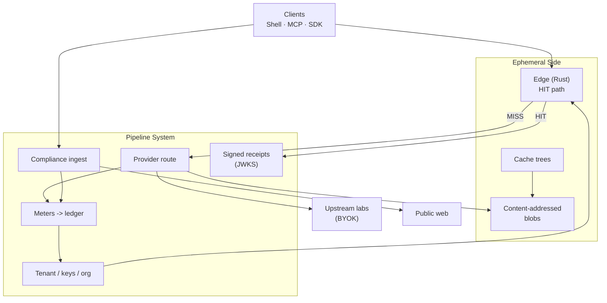
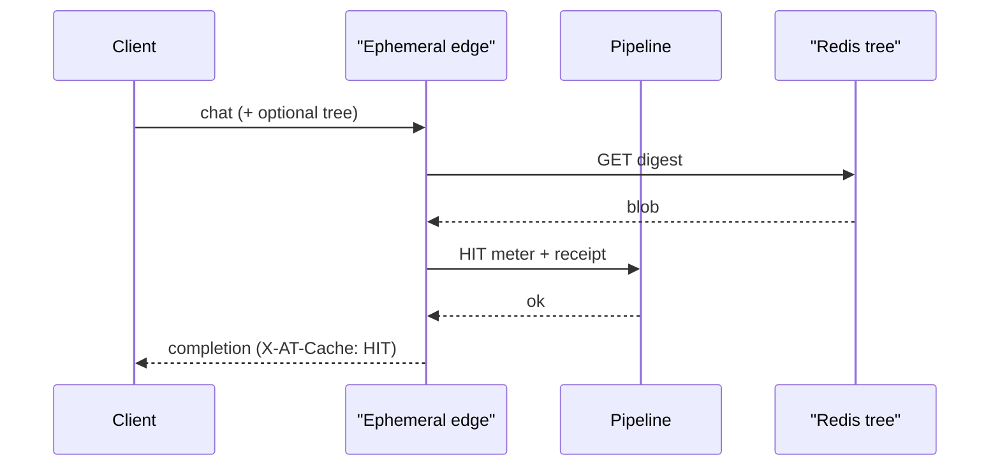
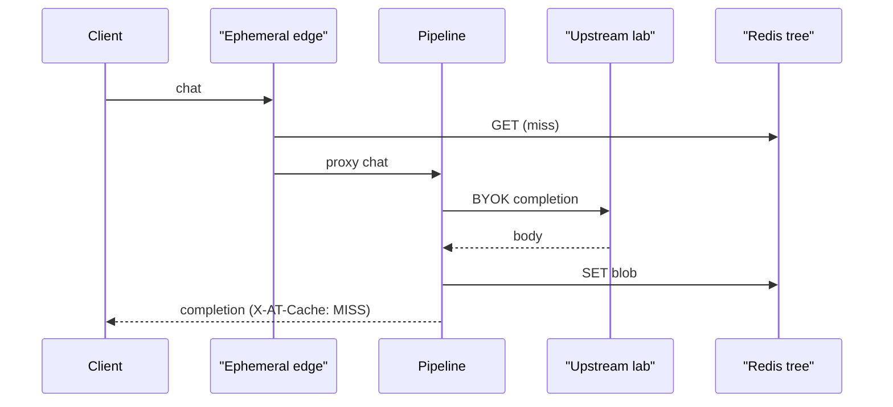

# Architecture overview

Inside withOhm: an ephemeral exact-replay side and a durable governance pipeline, connected by one metered crossing.

## Top-level overview

Instead of treating an AI gateway as a single opaque proxy tied to one vendor's session, withOhm splits AI traffic control into two independent containers: an **Ephemeral Side** and a **Pipeline System**. Clients (Agent Shell, SDKs, MCP) talk to one OpenAI-compatible ingress; the two containers meet on every request at a named crossing — **HIT or MISS** — that is always metered and, on HIT, receipted.

This separation is what makes exact-replay economically and operationally real. Inventory can be forked, isolated, and promoted without pretending to be a database. Money, policy, and compliance stay durable without sitting on the Redis hot path.

- **Ephemeral Side** — optimized for latency and mechanical repeat. Content-addressed completions, cache trees, edge GET. This layer does not own billing truth or legal policy; it can TTL, freeze, or tear down without losing the durable record.
- **Pipeline System** — optimized for correctness of *governance*: tenancy, metering, compliance ingest, provider route honesty, signed receipts, org audit. This layer defines who may cross, what a crossing costs, and what claims are stood behind.

Labs (BYOK or managed pool) remain outside both containers. Public web enters only through the Pipeline's compliance gate. Exact-replay inventory never becomes a training corpus.

## Resource hierarchy

withOhm organizes customer resources roughly as:

| Concept | Description | Relationship |
|---------|-------------|---------------|
| Organization | SSO, members, policy | Contains tenants / keys |
| Tenant | Billing and meter identity | Owns cache trees and ledger events |
| Cache tree | Named exact-replay inventory (`main`, `pr-842`, …) | Holds digests -> blobs |
| API key | Auth material (`sk-at-*`) | Bound to a tenant (and optionally an org) |
| Path / cost center | Attribution labels (`X-Ohm-Path`) | Ledger dimensions — **not** cache partitions |

## Ephemeral Side

The Ephemeral Side is where identical requests become free of upstream tokens. From the client's perspective nothing about the OpenAI chat shape is replaced: messages in, completion out, headers for cache and billing.

**It exists to serve and store exact-replay inventory, not to define money or law.**

- **Edge (`gateway-rs`, Rust)** — Redis GET on the hot path; stamps cache/plane headers.
- **Content-addressed blobs** — immutable completion JSON at `digest` (SHA-256 of canonicalized model + messages + extras).
- **Cache trees** — named namespaces over digests. Default `main` keeps the durable, shared inventory; named trees isolate a branch/PR/agent run. See [CACHE_TREES.md](CACHE_TREES.md).
- **Request context** — BYOK header (never persisted), optional tree header, `cache_control: no_store`.

When a chat request arrives:

- The request is canonicalized and hashed.
- On **HIT**, the blob is returned; the Pipeline mints a meter event and optional signed receipt. The lab is not called.
- On **MISS**, the Pipeline routes to an upstream provider (BYOK); the completion is written into the active tree (unless `no_store`).

Exact-match is absolute inside a tree. There is no semantic or fuzzy cache — receipts would stop meaning anything if there were.

## Pipeline System

If the Ephemeral Side is responsible for replay inventory, the Pipeline System is responsible for **who may cross, what it costs, and what withOhm will claim in public**.

Governance is composed of clear roles rather than one monolithic "proxy brain":

- **Auth / tenancy** — API keys, org SSO, suspension
- **Meters -> ledger** — HIT / MISS / fetch, metered and auditable
- **Compliance ingest** — purpose, robots.txt, SSRF, PII — before bytes reach a model. See [COMPLIANCE.md](COMPLIANCE.md).
- **Provider route** — multi-vendor BYOK; pre-first-byte failover honesty (no mid-stream magic)
- **Trust** — JWKS directory, HIT receipts, a published honesty map

### Correctness of claims

A HIT is not "free magic." It is:

1. An identical-request replay from tenant-scoped inventory
2. A metered pipe event
3. Optionally a signed receipt, verifiable against the public key directory ([RECEIPTS.md](RECEIPTS.md))

Savings endpoints stay `estimate_only`. The published honesty map (`GET /v1/public/honesty`) states non-goals so marketing can't outrun the pipe.

## HIT path: replaying without the lab

1. **Canonicalize and hash** the request (tree-scoped key).
2. **GET** from Redis on the Ephemeral Side.
3. **Pipeline gate** records the HIT meter and may mint `X-Ohm-Receipt`.
4. **Return** the blob. No upstream tokens.

## MISS path: ask the model, then store

1. **MISS** on inventory.
2. **Pipeline** enforces auth and policy.
3. **Upstream** generates (BYOK or managed pool).
4. **SET** into the active tree unless `no_store`.
5. **Meter** MISS (and fetch, if web context was injected earlier on the Pipeline).

Web context is never a back door around compliance: ingest runs on the Pipeline before digest and upstream.

## Durability of governance (not of every blob)

Durability in withOhm is layered on purpose:

- If the **edge** dies -> traffic falls through to the control plane; correctness of billing stays with the Pipeline.
- If a **cache blob** TTLs -> that exact-replay entry is gone; meters and ledger remain untouched.
- If provider or infra health degrades -> reconciliation and honesty/status surfaces exist so failure is visible, not vibes.

## What this architecture enables

- **Zero-upstream replay** — identical requests answer from Redis; the lab is not paid twice.
- **Tree-scoped isolation** — PR/agent inventories diverge without cloning tenants or databases ([CACHE_TREES.md](CACHE_TREES.md)).
- **Governed browse** — public web through robots/PII/SSRF gates before model contact ([COMPLIANCE.md](COMPLIANCE.md)).
- **Auditable claims** — receipts and a published honesty map bind marketing to machinery ([RECEIPTS.md](RECEIPTS.md)).

## In short

withOhm is an AI traffic control plane that treats:

- exact-replay inventory as **ephemeral and replaceable** (trees, TTL, edge);
- money, policy, compliance, and trust as **durable pipeline concerns**;
- the HIT/MISS crossing as the **source of economic truth** for the pipe;
- labs and the public web as **outside** systems reached only through explicit gates.

## Related docs

- [CACHE_TREES.md](CACHE_TREES.md) — branchable exact-replay
- [RECEIPTS.md](RECEIPTS.md) — HIT proof
- [COMPLIANCE.md](COMPLIANCE.md) — governed public-web ingest
- [POSITIONING.md](POSITIONING.md) — why this shape, and why not a routing proxy
- [GLOSSARY.md](GLOSSARY.md) — terms used throughout
